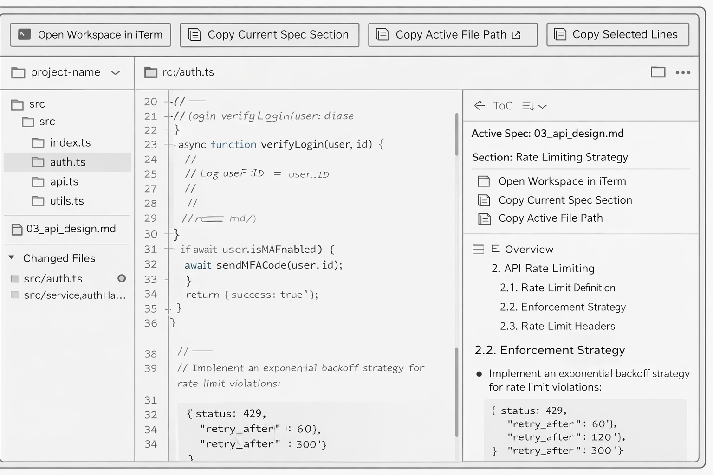

# SDD Workbench

A 3-panel desktop app for navigating software specs and source code side by side. Built for [Spec-Driven Development](https://en.wikipedia.org/wiki/Specification-driven_development) workflows where you maintain Markdown specifications alongside your codebase and want to jump between them seamlessly.



## What It Does

- **3-panel layout** -- file tree (left), code viewer (center), rendered spec (right)
- **Spec-to-code jump** -- click a file link in rendered Markdown to jump to the exact line in the code viewer
- **Inline comments** -- add comments on code or spec lines, export them as a Markdown bundle for LLM collaboration
- **Syntax highlighting** -- Shiki-based highlighting for 40+ languages with github-dark theme
- **Multi-workspace** -- open and switch between multiple project directories
- **File watcher** -- live change detection with markers that bubble up through collapsed directories
- **Remote workspace support** -- auto-detects SSHFS/network mounts and switches to polling watcher
- **Session restore** -- reopens your workspaces, files, specs, and scroll positions on restart
- **History navigation** -- Back/Forward with mouse buttons, swipe, or mouse wheel
- **Open In** -- open the current file in iTerm or VSCode with one click
- **Context copy** -- right-click to copy relative paths, selected code, or spec sections

## Prerequisites

- **Node.js** >= 18
- **npm** >= 9

## Installation

```bash
git clone https://github.com/hyunjoonlee/sdd-workbench.git
cd sdd-workbench
npm install
```

## Development

```bash
# Start the Electron app in dev mode (with hot reload)
npm run dev

# Run tests
npm test

# Lint
npm run lint

# Type check
npx tsc --noEmit
```

## Production Build

```bash
npm run build
```

This runs `tsc` + `vite build` + `electron-builder` to produce a distributable app package.

## Usage

### Opening a Workspace

1. Launch the app
2. Click **Open Workspace** and select a project directory
3. The file tree loads on the left -- click any file to preview it in the center panel

### Navigating Specs

1. Click a `.md` file in the tree -- it renders in the right panel
2. Click any file link in the rendered spec (e.g. `src/auth.ts#L42`) to jump to that code and line
3. Select text in the spec, right-click, and choose **Go to Source** to jump to the source line
4. Use the **Table of Contents** toggle at the top of the spec panel for quick section navigation

### Adding Comments

1. Select lines in the code viewer or text in the rendered spec
2. Right-click and choose **Add Comment**
3. Type your comment and save
4. Comment markers appear as numbered badges on the relevant lines
5. Hover over a marker to preview the comment

### Exporting Comments

1. Click **Export Comments** in the header
2. Choose a target file (defaults to `_COMMENTS.md`)
3. The export bundles pending comments with file paths, line ranges, and content -- ready to paste into an LLM prompt
4. Already-exported comments are skipped on subsequent exports (incremental)

### Global Comments

Use **Add Global Comments** to write workspace-level instructions (e.g. "always use strict TypeScript"). These are prepended to every export bundle.

### Remote Workspaces

Open an SSHFS-mounted directory as a workspace. The app auto-detects network mounts and switches to polling-based file watching. You can override the watch mode (`Auto` / `Native` / `Polling`) per workspace.

## Tech Stack

| Layer | Technology |
|-------|------------|
| Desktop runtime | Electron |
| UI framework | React 18 |
| Language | TypeScript |
| Build tool | Vite |
| Markdown rendering | react-markdown + remark-gfm + rehype-sanitize |
| Syntax highlighting | Shiki (github-dark theme, 40+ languages) |
| File watching | chokidar (native) + custom polling fallback |
| Testing | Vitest + Testing Library |
| Packaging | electron-builder |

## Project Structure

```
src/
  App.tsx                  # App shell, 3-panel layout, header actions
  App.css                  # All component styles
  workspace/               # Multi-workspace state, persistence, switcher
  file-tree/               # Directory tree panel
  code-viewer/             # Code preview, line selection, syntax highlight
  spec-viewer/             # Rendered Markdown, TOC, link/source jump
  code-comments/           # Comment CRUD, export, hover popover
  context-menu/            # Copy action popover
electron/
  main.ts                  # IPC handlers, file I/O, watcher lifecycle
  preload.ts               # Typed API bridge (contextIsolation)
  workspace-watch-mode.ts  # Remote mount detection, watch mode resolver
_sdd/
  spec/                    # Specification documents
  implementation/          # Implementation history per feature
```

## Tests

```bash
npm test
```

21 test files, 242 tests covering: workspace state model, session persistence, spec viewer, code viewer, file tree lazy loading, syntax highlighting, comment domain, and full integration tests.

## License

Private -- not published.
