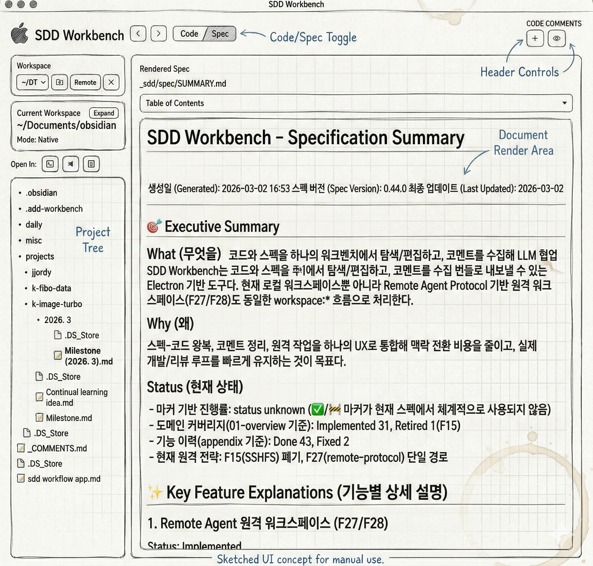

# SDD Workbench

SDD Workbench는 스펙 주도 개발(Spec-Driven Development) 워크플로우를 위한 Electron 데스크톱 앱입니다.
코드와 Markdown 스펙을 한 UI에서 탐색/편집하고, 코멘트를 구조화해 LLM 협업 번들로 내보낼 수 있습니다.

- English README: [`README_en.md`](README_en.md)



## 현재 제품 형태

- 2패널 레이아웃: 좌측 사이드바 + 우측 콘텐츠 탭(`Code` / `Spec`)
- 멀티 워크스페이스(열기/전환/닫기)
- CodeMirror 6 기반 코드 에디터(편집, 저장, 검색, 줄바꿈 토글)
- 렌더드 스펙 탐색(링크 점프, `Go to Source`, 문서 내 anchor 이동)
- 코드/스펙 인라인 코멘트 + 글로벌 코멘트 + 번들 export
- Remote Agent Protocol 기반 원격 워크스페이스(F27/F28)
- 워치 모드 제어(`Auto` / `Native` / `Polling`) + fallback
- 파일 트리 Git 배지(U/M) + 활성 파일 라인 Git 마커

## 요구 사항

### 로컬 실행

- Node.js >= 18
- npm >= 9
- Electron 앱을 실행할 수 있는 데스크톱 환경

### 원격 워크스페이스 연결 시

- SSH 접속 가능
- 원격 셸(`sh`/`bash`) 사용 가능
- 원격 호스트에 `node` 설치 및 PATH 등록
- 선택한 remote root에 읽기/쓰기 권한

## 설치

```bash
git clone https://github.com/hyunjoonlee/sdd-workbench.git
cd sdd-workbench
npm install
```

## 실행

### 개발 실행

```bash
npm run dev
```

### 테스트 / 린트 / 빌드

```bash
npm test
npm run lint
npm run build
```

참고:
- `npm test`, `npm run build` 시 원격 에이전트 runtime payload를 함께 갱신합니다.
- `npm run build`는 runtime build + TypeScript compile + Vite build + `electron-builder` 패키징을 수행합니다.

## 빠른 시작

### 1) 로컬 워크스페이스 열기

1. 앱 실행
2. 좌측 사이드바의 워크스페이스 `Open` 아이콘 클릭
3. 프로젝트 디렉토리 선택
4. 파일 트리에서 파일 선택

### 2) 콘텐츠 탭 전환

- `Code` 탭: 코드/파일 프리뷰 및 편집
- `Spec` 탭: Markdown 렌더 뷰
- 자동 전환 규칙:
  - `.md` 파일 선택 -> `Spec`
  - 그 외 파일 선택 -> `Code`

### 3) 스펙 <-> 코드 이동

- `Spec` 탭에서 `src/foo.ts#L10` 같은 링크 클릭 시 코드 파일 열기 + 라인 점프
- 스펙 텍스트 선택 후 `Go to Source` 실행
- 같은 문서 내 `#heading` anchor는 현재 스펙 패널 내부에서 스크롤 이동

## 상세 사용법

### 워크스페이스 사이드바

좌측 사이드바에서 다음 작업을 수행합니다.

- 워크스페이스 선택/전환
- 로컬 워크스페이스 열기
- 원격 워크스페이스 연결
- 워크스페이스 닫기
- 현재 워크스페이스 상태 확인(모드/원격 상태/워치 모드)
- `Open In` 실행(터미널 / VSCode)
- 파일 트리 탐색

키보드 단축키:
- `Cmd+Ctrl+Up` / `Cmd+Ctrl+Down`: 이전/다음 워크스페이스
- `Cmd+Ctrl+Left` / `Cmd+Ctrl+Right`: `Code`/`Spec` 탭 전환

### 파일 트리 작업

파일/디렉토리 우클릭 메뉴:
- `Copy Relative Path`
- `New File`
- `New Directory`
- `Rename`
- `Delete`

동작 특성:
- 대규모 트리를 위한 lazy loading/cap 정책 적용
- 하위 파일 변경 시 접힌 상위 디렉토리로 변경 마커 버블링
- Git 배지:
  - `U` = untracked/added
  - `M` = modified

### 코드 에디터 (`Code`)

주요 기능:
- 직접 편집
- `Cmd+S` 저장
- dirty 상태에서 이동/종료 시 guard
- `Cmd+F` 검색(이전/다음, wrap-around)
- 줄바꿈 토글(`Wrap On` / `Wrap Off`, 기본 On)
- 활성 파일 라인 Git 마커(`added` / `modified`)
- 코멘트 gutter 배지 + hover preview

우클릭 액션:
- `Copy Line Contents`
- `Copy Contents and Path`
- `Copy Relative Path`
- `Add Comment`

### 스펙 뷰어 (`Spec`)

주요 기능:
- Markdown 렌더 + TOC
- 상대 경로 링크 인터셉트 후 앱 내부 열기/점프
- same-document anchor 스크롤 처리
- 선택 액션:
  - `Add Comment`
  - `Go to Source`
- 코멘트 마커 + hover preview

### 코멘트 워크플로

#### 라인 코멘트 추가

1. 코드 라인 또는 스펙 텍스트 선택
2. `Add Comment` 실행
3. 코멘트 저장

#### 코멘트 관리 (`View Comments`)

- 라인 코멘트 목록 확인
- 코멘트 수정/삭제
- 이미 export한 코멘트 정리(Delete Exported)
- target 클릭으로 파일/라인 점프
- 글로벌 코멘트 인라인 수정/비우기
- export 시 global comments 포함 여부 선택

#### 내보내기 (`Export Comments`)

출력 대상:
- 워크스페이스 루트 `_COMMENTS.md`
- `.sdd-workbench/exports/` 아래 timestamped bundle

source-of-truth:
- `.sdd-workbench/comments.json`
- `.sdd-workbench/global-comments.md`

### 원격 워크스페이스 (Remote Agent Protocol)

#### 연결 절차

1. `Connect Remote Workspace` 클릭
2. 프로필 입력
   - `Host` (필수)
   - `User`, `Port` (선택)
   - `Identity File` (선택)
   - `Agent Path` (선택)
3. `Browse Directories` 클릭
4. Step 2 (`Directory`)에서 탐색 후 `Use Current Directory`
5. `Connect` 클릭

MVP 동작:
- 입력 프로필 draft를 로컬 저장소에 저장/재사용
- 연결 시 runtime 배포(덮어쓰기) + healthcheck/protocol 검증 수행
- 연결 후 로컬과 동일한 `workspace:*` 계약으로 동작

SSH 키 옵션:
- `Identity File` 지정 시 SSH `-i <identityFile>` + `IdentitiesOnly=yes` 적용

#### 원격 상태/복구

현재 워크스페이스 카드에서 확인/조작 가능:
- `REMOTE` 배지 + 상태(`CONNECTING` / `CONNECTED` / `DISCONNECTED` / `DEGRADED`)
- `Last error` 코드
- `Retry Connect`, `Disconnect Remote`

### Watch Mode

워크스페이스별 모드:
- `Auto`: 워크스페이스 타입 기준 자동 선택
- `Native`: native watcher 우선
- `Polling`: interval 기반 polling watcher

fallback:
- native watcher 시작 실패 시 polling으로 자동 강등 + 배너 표시

## 상태 저장 및 로그

### 세션 복원

앱 재시작 시 다음 상태를 복원합니다.
- 열린 워크스페이스
- 활성 파일/스펙
- 확장된 디렉토리
- 워치 모드 선호값

### 원격 로그

원격 연결/런타임 로그:
- macOS: `~/Library/Application Support/sdd-workbench/logs/remote-agent.log`
- Linux: `~/.config/sdd-workbench/logs/remote-agent.log`
- Windows: `%APPDATA%/sdd-workbench/logs/remote-agent.log`

## 트러블슈팅

### 1) `BOOTSTRAP_FAILED`

확인 항목:
- 원격 PATH에 `node` 존재 여부
- 로컬 `Identity File` 경로 유효성
- remote root 존재/권한
- agent path 실행 가능 여부

수동 프로브 예시:

```bash
ssh -i ~/.ssh/id_ed25519 -p <PORT> <USER>@<HOST> \
  '$HOME/.sdd-workbench/bin/sdd-remote-agent --protocol-version'
```

### 2) `CONNECTION_CLOSED`

먼저 `remote-agent.log` 확인 권장.
주요 원인:
- SSH 인증 불일치
- 원격 커맨드 시작 실패
- protocol/bootstrap 불일치

### 3) `Workspace index truncated at 100,000 nodes`

대규모 트리에서 정상 동작입니다.
더 깊은 디렉토리로 내려가거나 remote root 범위를 좁혀서 인덱싱 범위를 줄이세요.

### 4) Polling 모드 고정

원격 세션 또는 native watcher fallback에서는 정상입니다.
Polling interval 기준으로 변경 사항을 계속 감지합니다.

## 프로젝트 구조

```text
src/
  App.tsx                     # 앱 셸/오케스트레이션
  workspace/                  # 워크스페이스 상태, 영속화, remote connect modal
  file-tree/                  # 파일 트리 UI, lazy loading, CRUD 인터랙션
  code-editor/                # CodeMirror 6 에디터 + gutter 확장
  spec-viewer/                # 렌더드 Markdown 뷰 + 링크/소스 액션
  code-comments/              # 코멘트 도메인, 모달, export
electron/
  main.ts                     # IPC 핸들러, watcher lifecycle, backend routing
  preload.ts                  # typed window.workspace bridge
  workspace-backend/          # local/remote backend 추상화
  remote-agent/               # SSH transport, bootstrap, protocol, runtime
scripts/
  build-remote-agent-runtime.mjs
_sdd/
  spec/                       # 스펙 문서
  implementation/             # 구현 계획/진행/리뷰 기록
```

## 스펙 및 참고 문서

- 스펙 인덱스: [`_sdd/spec/main.md`](_sdd/spec/main.md)
- 스펙 요약: [`_sdd/spec/SUMMARY.md`](_sdd/spec/SUMMARY.md)

## 라이선스

사내/비공개 저장소 용도(Private repository).
